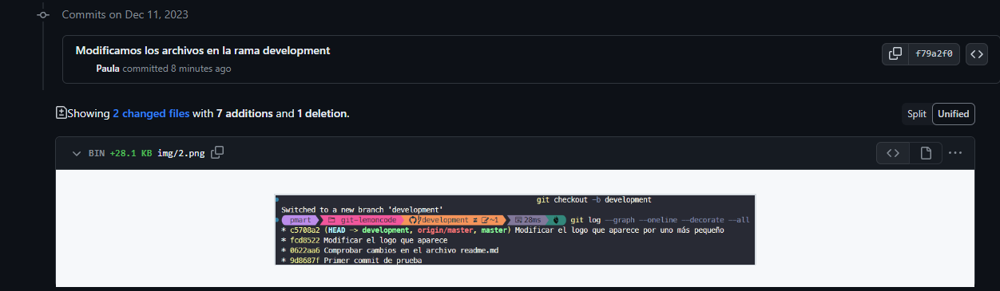

# Proyecto Git LemonCode 

## Crear un repositorio en local | Subir el repositorio a Github | Hacer un commit y un push

Para comenzar este proyecto he creado una carpeta con el nombre **git-lemoncode**. Con el directorio aún vacio he inicializado git en el repositorio local utilizando el comando

```git
git ini
```

A continuación he creado el archivo readme.me y procedí a agregarlo al repositorio local con el comando

```git
git add .
```

Realice el commit de dichos archivos y cree el repositorio en la nube en GitHub. Tras tener disponible la URL del repositorio utilice los comandos

```git

git remote add origin + url

```

```git

git push -u origin master

```

Para enlazar con el repositorio en la nube y luego subir los archivos a GitHub


## Crear una rama

He procedido a crear una nueva rama llamada \_development y he aprovechado la misma linea del comando para cambiar el puntero a ella. Procedo con el comando log a verificar el cambio


Al escribir el comando **git push** nos aparece el siguiente error

fatal: The current branch development has no upstream branch.
To push the current branch and set the remote as upstream, use

    git push --set-upstream origin development

To have this happen automatically for branches without a tracking
upstream, see 'push.autoSetupRemote' in 'git help config'.

Buscamos información sobre dicho error y vemos que el código para solucionarlo es el siguiente:

[Git Tower](https://www.git-tower.com/learn/git/faq/set-upstream)  
[Git-scm](https://git-scm.com/docs/git-push#Documentation/git-push.txt--u)

```git
git push --set-upstream origin development
```

Comprobamos que en Github aparece el nuevo contenido de la rama development



